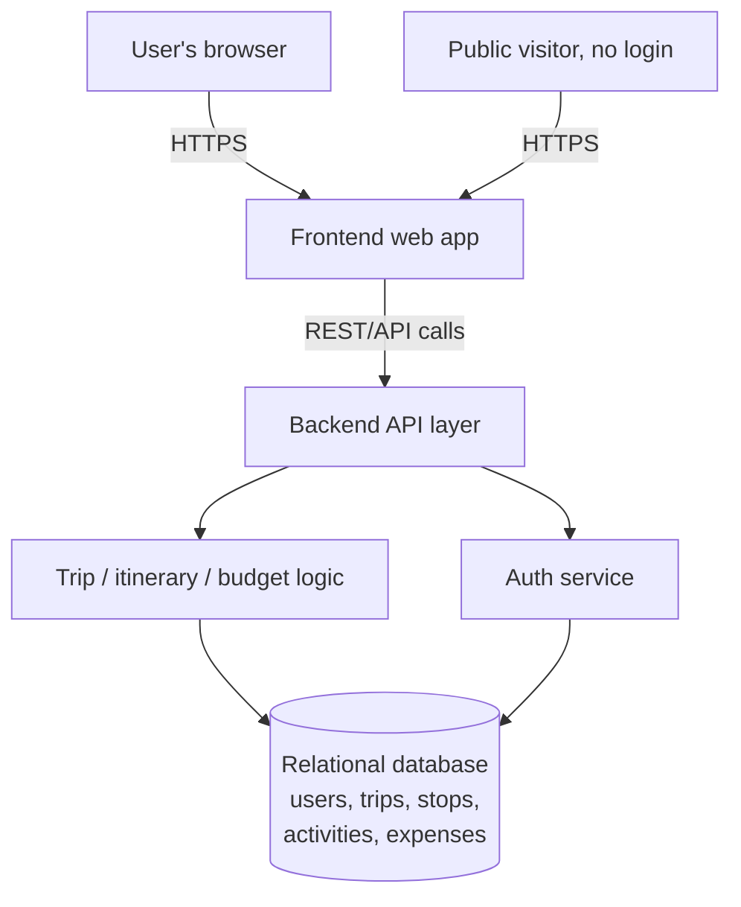

# GlobeTrotter — Project Context

## 1. Elevator Pitch

GlobeTrotter is a personalized, collaborative travel-planning web app that lets users build multi-city trips end-to-end — picking cities and activities, laying them out on a day-by-day itinerary, seeing an automatic budget breakdown, and sharing the finished plan with friends or the public — turning the often-messy process of trip planning into a single guided, visual workflow.

## 2. Problem & Target User

**Problem:** Planning a multi-city trip today is fragmented — travelers juggle spreadsheets, notes apps, browser tabs of blog posts, and separate budgeting tools to piece together where they're going, what they're doing, and what it will cost. There's no single place to structure stops, attach activities and dates to each stop, see a running budget, and share the result.

**Target user / persona:** An independent, budget-conscious leisure traveler planning a multi-city or multi-stop trip (e.g., a 2–3 week backpacking or city-hopping trip across several countries) who wants a visual, organized plan they can build incrementally, check against a budget, and optionally share with travel companions or a wider community for inspiration.

## 3. Core Value Proposition

- **One tool instead of five:** itinerary building, activity/city discovery, budgeting, and sharing live in a single flow instead of scattered documents.
- **Structure without rigidity:** trips are built from flexible "stops" and "sections" (travel/hotel/activity) rather than a fixed template, so it adapts to different trip styles.
- **Visibility by default:** every itinerary automatically rolls up into a budget breakdown and a calendar/timeline view — the user doesn't have to build these manually.
- **Shareable and social:** trips can be made public or shared with a link, and a community tab lets users discover and copy other travelers' itineraries — turning planning into something others can learn from, not just a private task.

## 4. Scope

### In scope (hackathon build)
- User authentication (login/signup)
- Dashboard/home with recent trips and recommendations
- Create Trip flow (name, dates, description)
- Itinerary Builder — add stops (cities), assign dates and activities, reorder stops
- City Search and Activity Search
- Itinerary View with day-wise / grouped layout
- Trip Budget & Cost Breakdown (transport, stay, activities, meals)
- Trip Calendar / Timeline view
- Shared / Public Itinerary View with a "Copy Trip" action
- Community Tab for browsing shared trips
- User Profile / Settings

### Explicitly out of scope (for this hackathon)
- Real payment processing or booking integrations (flights, hotels) — costs are estimates only, not live pricing
- Real-time collaborative multi-user editing of the same itinerary (concurrent editing)
- Native mobile apps (the brief calls for a responsive web experience, not iOS/Android builds)
- Automated recommendation/ML-based personalization engine — "suggestions" are treated as a curated/static list, not a trained model
- Full production-grade security hardening (rate limiting, advanced fraud detection, etc.)
- Admin / Analytics Dashboard is explicitly marked **optional** in the source PDF — treat as a stretch goal, not a baseline deliverable

## 5. Success Criteria

The source PDF does not state explicit judging criteria, scoring rubric, or evaluation weights. No success metrics were provided in either the problem statement or the mockup file.

**Assumption for the team:** in the absence of stated criteria, prioritize (a) a working end-to-end flow from signup → create trip → build itinerary → view budget, since this is the "spine" the rest of the features hang off, and (b) correct use of a relational database to model the trip/stop/activity/expense relationships, since the PDF explicitly calls this out as a requirement. Confirm actual judging criteria with hackathon organizers if available.

## 6. Key Assumptions

Made while reconciling the PDF (feature list) with the Excalidraw file (visual mockup, 12 screens):

1. The Excalidraw mockup is the more literal/current design reference; where it adds detail not in the PDF (e.g., Registration screen fields, Community Tab), we treat those as valid additional scope rather than errors.
2. "Sections" in the Itinerary Builder (Section 1, 2, 3 in the mockup) map to the PDF's "stops/activities" concept — a section can represent a travel leg, a hotel stay, or an activity block, not strictly one city per section.
3. The Admin/Analytics Dashboard is optional per the PDF and is treated as a stretch feature to build only if time permits.
4. "Group by / Filter / Sort by" controls, repeated across nearly every list screen in the mockup, are assumed to share one reusable component rather than being built per-screen.
5. The Community Tab is assumed to surface only **shared/public** trips (not private ones), consistent with the "Shared/Public Itinerary View" concept from the PDF.
6. Budget figures are assumed to be user-entered or estimated (not pulled from live pricing APIs), since no booking/payment integration is in scope.

## 7. Open Questions

Ambiguities or contradictions between the two source documents that the team should resolve before/during build:

1. **Registration screen** appears only in the mockup, not as its own numbered feature in the PDF (which starts numbering at "Login/Signup Screen"). Should Login and Registration be one combined screen or two, as the mockup implies?
2. **Community Tab** is a full mockup screen (Screen 10) but isn't listed as a numbered feature in the PDF's 13-item list. Is it in scope for the hackathon, or was it a design exploration beyond the written brief?
3. **Screen count mismatch:** the PDF lists 13 features/screens; the mockup shows 12 screens with different groupings (e.g., it merges/splits some PDF items differently). Which document should be treated as the source of truth if they conflict?
4. **Section vs. Stop vs. City terminology** is inconsistent: the PDF talks about "stops" and "cities," while the mockup's Itinerary Builder uses "Section 1/2/3" with generic descriptions ("this can be anything like travel section, hotel, or activity"). Does a "section" always map 1:1 to a city/stop, or can one stop contain multiple sections?
5. **Admin Dashboard access:** the PDF marks it "(Optional)"; no login/role-based access design is shown in the mockup. Is a proper admin role/permission system in scope, or is a simple gated route acceptable for the hackathon?
6. **"Copy Trip"** — the PDF describes this only for the Shared/Public Itinerary View; unclear whether copying preserves the original owner's dates or requires the copying user to re-enter dates.
7. No explicit **data retention / privacy** requirements are stated for public trip sharing — should personal details (e.g., real names) be stripped from a publicly shared itinerary?

## 8. High-Level System Overview

GlobeTrotter follows a standard three-tier web architecture: a responsive frontend (the screens described in `features.md`/`sitemap.md`) talks to a backend API layer, which enforces business logic (budget calculations, itinerary assembly, sharing/permissions) and reads/writes a relational database modeling users, trips, stops, activities, and expenses. Public/shared itinerary requests bypass authentication but still route through the same API and database.

