# GlobeTrotter — Database Schema

Relational schema (PostgreSQL, per `backendrules.md`) covering every table implied by `features.md`, `sitemap.md`, and `router.md`. Column types use PostgreSQL/Prisma-style naming.

## 1. Tables

### `users`
| Column | Type | Nullable | Default | Notes |
|---|---|---|---|---|
| `id` | uuid | No | `gen_random_uuid()` | PK |
| `email` | varchar(255) | No | — | unique |
| `password_hash` | varchar(255) | No | — | never store plaintext |
| `first_name` | varchar(100) | No | — | |
| `last_name` | varchar(100) | No | — | |
| `username` | varchar(50) | No | — | unique |
| `phone_number` | varchar(30) | Yes | `NULL` | |
| `city` | varchar(100) | Yes | `NULL` | user's home city (from Registration screen) |
| `country` | varchar(100) | Yes | `NULL` | |
| `photo_url` | text | Yes | `NULL` | profile photo |
| `language_preference` | varchar(10) | No | `'en'` | |
| `role` | enum(`user`, `admin`) | No | `'user'` | gates Admin routes |
| `created_at` | timestamptz | No | `now()` | |
| `updated_at` | timestamptz | No | `now()` | |
| `deleted_at` | timestamptz | Yes | `NULL` | soft delete for "Delete account" |

### `password_reset_tokens`
| Column | Type | Nullable | Default | Notes |
|---|---|---|---|---|
| `id` | uuid | No | `gen_random_uuid()` | PK |
| `user_id` | uuid | No | — | FK → `users.id` |
| `token_hash` | varchar(255) | No | — | unique |
| `expires_at` | timestamptz | No | — | |
| `used_at` | timestamptz | Yes | `NULL` | |
| `created_at` | timestamptz | No | `now()` | |

### `cities`
Reference/master data for City Search.
| Column | Type | Nullable | Default | Notes |
|---|---|---|---|---|
| `id` | uuid | No | `gen_random_uuid()` | PK |
| `name` | varchar(150) | No | — | |
| `country` | varchar(100) | No | — | |
| `region` | varchar(100) | Yes | `NULL` | for region filter |
| `cost_index` | numeric(6,2) | Yes | `NULL` | relative cost indicator |
| `popularity_score` | integer | No | `0` | drives "Top Regional Selections" |
| `image_url` | text | Yes | `NULL` | |
| `created_at` | timestamptz | No | `now()` | |

### `activities`
Reference/master data for Activity Search.
| Column | Type | Nullable | Default | Notes |
|---|---|---|---|---|
| `id` | uuid | No | `gen_random_uuid()` | PK |
| `city_id` | uuid | Yes | `NULL` | FK → `cities.id`; nullable for city-agnostic activities |
| `name` | varchar(200) | No | — | |
| `description` | text | Yes | `NULL` | |
| `category` | enum(`sightseeing`, `food`, `adventure`, `culture`, `nightlife`, `relaxation`, `other`) | No | `'other'` | activity type filter |
| `estimated_cost` | numeric(10,2) | No | `0` | |
| `estimated_duration_minutes` | integer | Yes | `NULL` | |
| `image_url` | text | Yes | `NULL` | |
| `created_at` | timestamptz | No | `now()` | |

### `trips`
| Column | Type | Nullable | Default | Notes |
|---|---|---|---|---|
| `id` | uuid | No | `gen_random_uuid()` | PK |
| `user_id` | uuid | No | — | FK → `users.id` (owner) |
| `name` | varchar(200) | No | — | |
| `description` | text | Yes | `NULL` | |
| `cover_photo_url` | text | Yes | `NULL` | |
| `start_date` | date | No | — | |
| `end_date` | date | No | — | check: `end_date >= start_date` |
| `status` | enum(`upcoming`, `ongoing`, `completed`) | No | `'upcoming'` | derived on read from dates, stored for query performance |
| `total_budget` | numeric(10,2) | Yes | `NULL` | user-set target, distinct from calculated cost |
| `is_public` | boolean | No | `false` | toggled when a share link is generated |
| `created_at` | timestamptz | No | `now()` | |
| `updated_at` | timestamptz | No | `now()` | |
| `deleted_at` | timestamptz | Yes | `NULL` | soft delete |

### `trip_stops`
One row per "section"/stop in the Itinerary Builder (see `projectcontext.md` open question #4 — `type` column exists precisely because a section can be a city stop, travel leg, or lodging block, not only a city).
| Column | Type | Nullable | Default | Notes |
|---|---|---|---|---|
| `id` | uuid | No | `gen_random_uuid()` | PK |
| `trip_id` | uuid | No | — | FK → `trips.id`, `ON DELETE CASCADE` |
| `city_id` | uuid | Yes | `NULL` | FK → `cities.id`; nullable for non-city sections (pure travel/hotel entries) |
| `type` | enum(`city_stop`, `travel`, `lodging`, `activity_block`) | No | `'city_stop'` | |
| `title` | varchar(200) | No | — | e.g. "Section 1", or custom label |
| `description` | text | Yes | `NULL` | |
| `start_date` | date | No | — | |
| `end_date` | date | No | — | check: `end_date >= start_date` |
| `budget` | numeric(10,2) | Yes | `NULL` | per-section budget, mockup's "Budget of this section" |
| `sort_order` | integer | No | `0` | drives reordering |
| `created_at` | timestamptz | No | `now()` | |
| `updated_at` | timestamptz | No | `now()` | |

### `trip_stop_activities`
Join table: activities assigned to a specific stop, with trip-specific overrides.
| Column | Type | Nullable | Default | Notes |
|---|---|---|---|---|
| `id` | uuid | No | `gen_random_uuid()` | PK |
| `trip_stop_id` | uuid | No | — | FK → `trip_stops.id`, `ON DELETE CASCADE` |
| `activity_id` | uuid | No | — | FK → `activities.id` |
| `scheduled_date` | date | Yes | `NULL` | which day within the stop |
| `scheduled_time` | time | Yes | `NULL` | for day-wise/timeline layout |
| `cost_override` | numeric(10,2) | Yes | `NULL` | if user edits the default activity cost |
| `sort_order` | integer | No | `0` | |
| `created_at` | timestamptz | No | `now()` | |

**Unique constraint:** (`trip_stop_id`, `activity_id`) — an activity can't be added twice to the same stop.

### `expenses`
Ad-hoc cost line items not tied to a catalog activity (e.g. flights, misc costs) — feeds the Budget & Cost Breakdown screen alongside activity/stop costs.
| Column | Type | Nullable | Default | Notes |
|---|---|---|---|---|
| `id` | uuid | No | `gen_random_uuid()` | PK |
| `trip_id` | uuid | No | — | FK → `trips.id`, `ON DELETE CASCADE` |
| `trip_stop_id` | uuid | Yes | `NULL` | FK → `trip_stops.id`; nullable for trip-level costs (e.g. international flight) |
| `category` | enum(`transport`, `stay`, `activities`, `meals`, `other`) | No | `'other'` | matches Budget screen's breakdown categories |
| `label` | varchar(200) | No | — | |
| `amount` | numeric(10,2) | No | — | check: `amount >= 0` |
| `created_at` | timestamptz | No | `now()` | |

### `trip_shares`
| Column | Type | Nullable | Default | Notes |
|---|---|---|---|---|
| `id` | uuid | No | `gen_random_uuid()` | PK |
| `trip_id` | uuid | No | — | FK → `trips.id`, `ON DELETE CASCADE`, unique (one active share per trip) |
| `share_token` | varchar(64) | No | — | unique, unguessable random token |
| `created_by` | uuid | No | — | FK → `users.id` |
| `view_count` | integer | No | `0` | |
| `created_at` | timestamptz | No | `now()` | |
| `revoked_at` | timestamptz | Yes | `NULL` | supports un-sharing without deleting history |

### `trip_copies`
Tracks provenance when a user copies a shared trip (supports Community/Public View "Copy Trip").
| Column | Type | Nullable | Default | Notes |
|---|---|---|---|---|
| `id` | uuid | No | `gen_random_uuid()` | PK |
| `source_trip_id` | uuid | No | — | FK → `trips.id` (original) |
| `copied_trip_id` | uuid | No | — | FK → `trips.id` (new copy), unique |
| `copied_by` | uuid | No | — | FK → `users.id` |
| `created_at` | timestamptz | No | `now()` | |

### `saved_destinations`
Supports Profile screen's "saved destinations list."
| Column | Type | Nullable | Default | Notes |
|---|---|---|---|---|
| `id` | uuid | No | `gen_random_uuid()` | PK |
| `user_id` | uuid | No | — | FK → `users.id`, `ON DELETE CASCADE` |
| `city_id` | uuid | No | — | FK → `cities.id` |
| `created_at` | timestamptz | No | `now()` | |

**Unique constraint:** (`user_id`, `city_id`).

## 2. Entity-Relationship Diagram

```mermaid
erDiagram
  USERS ||--o{ TRIPS : owns
  USERS ||--o{ SAVED_DESTINATIONS : saves
  USERS ||--o{ PASSWORD_RESET_TOKENS : requests
  USERS ||--o{ TRIP_SHARES : creates
  USERS ||--o{ TRIP_COPIES : copies

  TRIPS ||--o{ TRIP_STOPS : contains
  TRIPS ||--o{ EXPENSES : has
  TRIPS ||--o| TRIP_SHARES : "shared via"
  TRIPS ||--o| TRIP_COPIES : "copied as"

  TRIP_STOPS ||--o{ TRIP_STOP_ACTIVITIES : includes
  TRIP_STOPS ||--o{ EXPENSES : "may have"
  TRIP_STOPS }o--|| CITIES : "located in"

  ACTIVITIES ||--o{ TRIP_STOP_ACTIVITIES : "assigned via"
  ACTIVITIES }o--|| CITIES : "belongs to"

  CITIES ||--o{ SAVED_DESTINATIONS : "saved as"

  USERS {
    uuid id PK
    string email
    string username
    string role
  }
  TRIPS {
    uuid id PK
    uuid user_id FK
    string name
    date start_date
    date end_date
    string status
    boolean is_public
  }
  TRIP_STOPS {
    uuid id PK
    uuid trip_id FK
    uuid city_id FK
    string type
    date start_date
    date end_date
  }
  TRIP_STOP_ACTIVITIES {
    uuid id PK
    uuid trip_stop_id FK
    uuid activity_id FK
  }
  CITIES {
    uuid id PK
    string name
    string country
  }
  ACTIVITIES {
    uuid id PK
    uuid city_id FK
    string name
    string category
  }
  EXPENSES {
    uuid id PK
    uuid trip_id FK
    uuid trip_stop_id FK
    string category
    numeric amount
  }
  TRIP_SHARES {
    uuid id PK
    uuid trip_id FK
    string share_token
  }
  TRIP_COPIES {
    uuid id PK
    uuid source_trip_id FK
    uuid copied_trip_id FK
  }
  SAVED_DESTINATIONS {
    uuid id PK
    uuid user_id FK
    uuid city_id FK
  }
```

## 3. Constraints Summary

**Unique constraints**
- `users.email`, `users.username`
- `password_reset_tokens.token_hash`
- `trip_shares.trip_id` (one active share record per trip), `trip_shares.share_token`
- `trip_copies.copied_trip_id`
- `trip_stop_activities` on (`trip_stop_id`, `activity_id`)
- `saved_destinations` on (`user_id`, `city_id`)

**Check constraints**
- `trips`: `end_date >= start_date`
- `trip_stops`: `end_date >= start_date`
- `expenses`: `amount >= 0`
- `activities`: `estimated_cost >= 0`

**Enum values**
- `users.role`: `user`, `admin`
- `trips.status`: `upcoming`, `ongoing`, `completed`
- `trip_stops.type`: `city_stop`, `travel`, `lodging`, `activity_block`
- `activities.category`: `sightseeing`, `food`, `adventure`, `culture`, `nightlife`, `relaxation`, `other`
- `expenses.category`: `transport`, `stay`, `activities`, `meals`, `other`

**Foreign key delete behavior**
- `trip_stops.trip_id`, `trip_stop_activities.trip_stop_id`, `expenses.trip_id`, `saved_destinations.user_id` → `ON DELETE CASCADE` (deleting a trip/user cleans up its dependents).
- `trip_stops.city_id`, `activities.city_id`, `expenses.trip_stop_id` → `ON DELETE SET NULL` (deleting reference data shouldn't destroy trip history).
- `trip_shares.trip_id`, `trip_copies.*` → `ON DELETE CASCADE`.

## 4. Indexing Notes

Indexes beyond the automatic ones on primary keys and unique constraints, based on the query patterns in `router.md`:

| Table | Index | Reason |
|---|---|---|
| `trips` | (`user_id`, `status`) | My Trips / Dashboard list filtered by owner + status |
| `trips` | (`is_public`) partial index where `is_public = true` | Community feed query |
| `trip_stops` | (`trip_id`, `sort_order`) | Itinerary Builder/View always fetches a trip's stops in order |
| `trip_stop_activities` | (`trip_stop_id`, `sort_order`) | same pattern, for activities within a stop |
| `cities` | (`country`) and full-text/trigram index on `name` | City Search filter + search-as-you-type |
| `activities` | (`city_id`, `category`) | Activity Search filters |
| `expenses` | (`trip_id`, `category`) | Budget breakdown aggregation |
| `trip_shares` | (`share_token`) — already unique, but confirm it's the lookup path, not `trip_id` | Public itinerary view is looked up by token, not trip id |
| `password_reset_tokens` | (`token_hash`), (`expires_at`) | fast token lookup + cleanup job for expired tokens |

## 5. Seed / Reference Data

The following tables need to be pre-populated before the app is usable, since they're browsed rather than user-created:

- **`cities`**: a starter set (~30-50 cities) spanning multiple countries/regions, with `cost_index` and `popularity_score` filled in, to make City Search and "Top Regional Selections" non-empty on first run.
- **`activities`**: a starter catalog (~5-10 activities per seeded city) covering all `category` enum values, so Activity Search filters have something to return.
- **`users`**: one seeded `admin` role user for local development access to the Admin Dashboard.
- No seed data is needed for `trips`, `trip_stops`, `expenses`, `trip_shares`, or `saved_destinations` — these are entirely user-generated.

## 6. Migration / Versioning Convention

- **Tooling:** Prisma Migrate (`prisma migrate dev` locally, `prisma migrate deploy` in CI/production), consistent with `backendrules.md`'s Prisma choice.
- **One migration per logical schema change** — don't batch unrelated table changes into a single migration file.
- **Naming:** timestamp-prefixed (Prisma's default) followed by a short snake_case description of the change, e.g. `20260410120000_add_trip_shares_table`.
- **Never edit a migration file that has already been applied to any shared environment** (staging/production/teammates' machines) — write a new migration to alter it instead. Editing history causes drift between environments.
- `schema.prisma` is the single source of truth; this document (`schema.md`) is kept in sync manually whenever `schema.prisma` changes — if they disagree, `schema.prisma` (and its migration history) wins, and this file should be updated to match.
- Seed data (Section 5) lives in a dedicated `prisma/seed.ts` script, re-runnable idempotently (upsert, not insert) so it can run safely against an already-seeded database.
- Destructive migrations (dropping a column/table) require a reviewed PR and, where feasible, a preceding "deprecate first" migration rather than an immediate drop — not a strict requirement for the hackathon timeline, but the default habit to follow.
